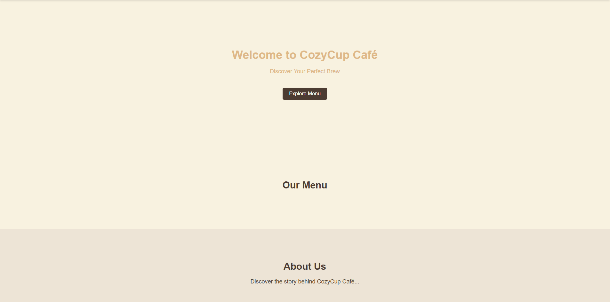

# Cozy Cup Cafe ☕️

## Project Description
Cozy Cup Cafe is a simple and welcoming website designed to showcase a café’s menu, atmosphere, and services. The project focuses on clean design and easy navigation to give users a warm, café-like experience online.

## Features
- Home page with a cozy café theme  
- Menu section displaying drinks and food items  
- About section describing the café’s story  
- Contact section with location and contact details  
- Responsive design for desktop and mobile devices  

## Screen Captures

**Home Page:** Displays the main landing page with a warm and inviting café design.

**Menu Page:** Shows the list of coffee, drinks, and snacks offered at Cozy Cup Cafe.

**About Page:** Shares the story, mission, and vibe of the café.

**Contact Page:** Provides contact information and location details for customers.

## About the Authors
This project was created by the Cozy Cup Cafe development team as part of a learning project focused on web design and Git version control.
